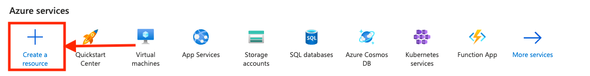
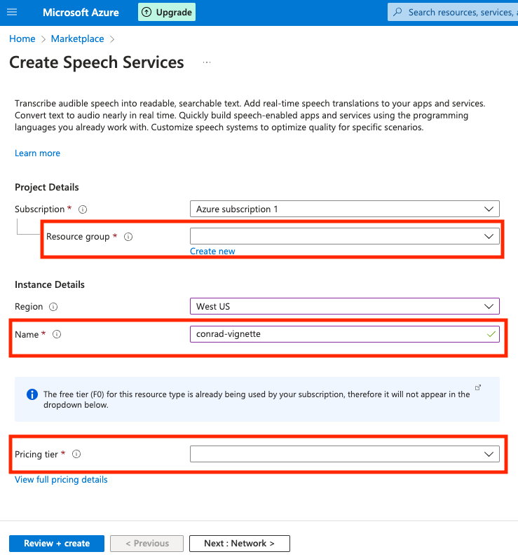
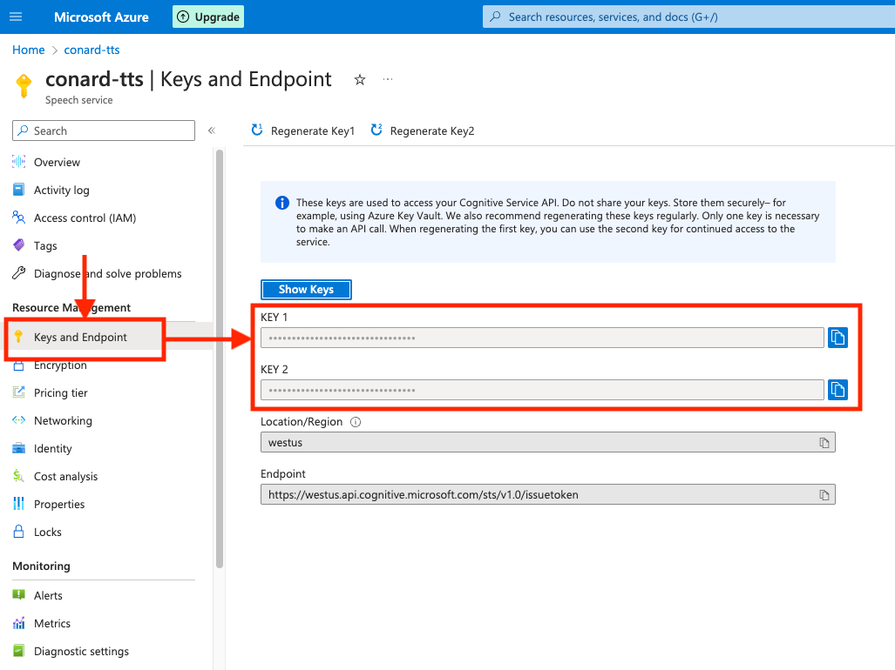

```{r, include = FALSE}
knitr::opts_chunk$set(
  collapse = TRUE,
  comment = "#>"
)
```

This vignette provides a step-by-step demonstration (including screenshots) of generating an API key to access the Microsoft Cognitive Services API and setting the API key so that conrad can use the API key to access the API and perform text-to-speech. Note that users can follow a similar process to obtain an API key for accessing various other services provided by Azure Cognitive Services, such as Speech to text, Speech translation, and more.

## Getting an API key


1. Sign in/Create an Azure account on [Microsoft Azure Cognitive Services](https://azure.microsoft.com/en-us/free/cognitive-services/).

2. Click `+ Create a resource` (below "Azure services" or click on the Hamburger button)

```{r, echo=FALSE, out.width = "90%", out.height = "70%"}

```


3. Search for "Speech" and Click `Create` -> `Speech`


4. Create a [Resource group](https://learn.microsoft.com/en-us/azure/azure-resource-manager/management/manage-resource-groups-portal#what-is-a-resource-group) and a "Name".

```{r, echo=FALSE, out.width = "90%", out.height = "70%"}

```

5. Choose `Pricing tier` (you can choose the free version with `Free F0`)
6. Click `Review + create`, review the Terms, and click `Create`.  

If the deployment was successful, you should see :white_check_mark: **Your deployment is complete** on the next page.

7. Under `Next steps`, click `Go to resource`
8. Look on the left sidebar and under `Resource Management`, click `Keys and Endpoint`

```{r, echo=FALSE, out.width = "90%", out.height = "70%"}

```


9. Copy either `KEY 1` or `KEY 2` to clipboard. Only one key is necessary to make an API call.

Once you complete these steps, you have successfully retrieved your API keys to access the API. 

:warning: Remember your `Location/Region`, which you use to make calls to the API. Specifying a different region will lead to a [HTTP 403 Forbidden response](https://developer.mozilla.org/en-US/docs/Web/HTTP/Status/403).


## Setting your API key

You can set your API key in a number of ways:

1. Edit `~/.Renviron` and set `MS_TTS_API_KEY = "YOUR_API_KEY"`
2. In `R`, use `options(ms_tts_key = "YOUR_API_KEY")`.
3. Set `export MS_TTS_API_KEY=YOUR_API_KEY` in `.bash_profile`/`.bashrc` if you're using `R` in the terminal.
4. Pass `api_key = "YOUR_API_KEY"` in arguments of functions such as `ms_list_voices(api_key = "YOUR_API_KEY")`.
